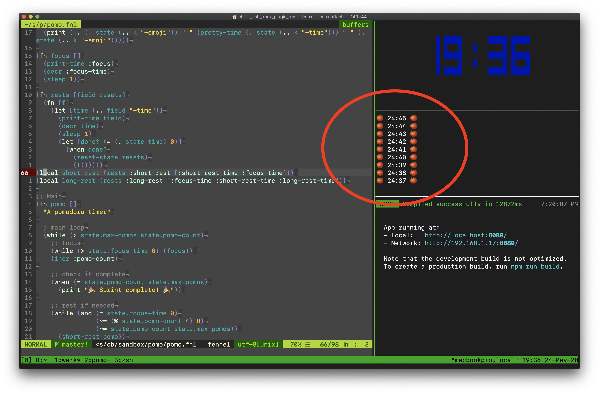

It's a small pomodoro timer that runs in the terminal.

**WARNING**: because of the way the `sleep` function is written, you will have to manually kill this process to exit early. It's a feature: you are COMMITTED to the timer! 😁

## How I use it

I let the pomo run in a small pane in tmux next to other auxiliary panes like server logs, test runners, etc.

## Run it

1. configure:

    - If pomo is installed on a [shared computer](http://tilde.town/), `cp pomo-config-example.fnl ~/.pomo-config.fnl` and edit it how you like it
    - If you're running it yourself, you can just edit the `defaults` table in pomo.fnl

2. execute: `fennel pomo.fnl`

## Dependencies

- [fennel](https://fennel-lang.org/): `luarocks install fennel` (`brew install luarocks` if necessary)
- entr (optional): the makefile (`make dev`) uses entr to watch for changes to pomo.fnl (`brew install entr`)
